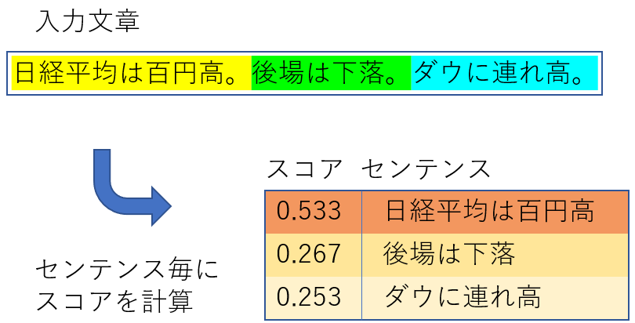
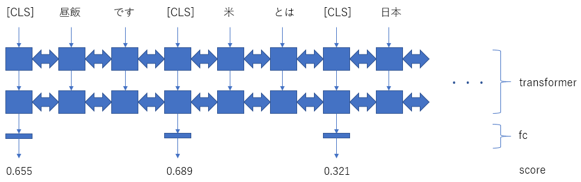
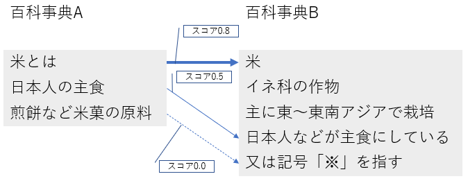

# text2importance-japanese
Get Meaning Importance in Long Text    

このプロジェクトは、[スポンサーを募集しています](https://github.com/tanreinama/gpt2-japanese/blob/master/report/sponsor.md)。

# text2importance-japaneseとは何か？


**長い文章から、その全体の意味に対する重要度を、センテンス毎に求めるAIモデルです。**



重要度の高いセンテンスを取り出せば抽出型要約AIとして、逆に重要度の低いセンテンスを取り除けば長文フィルターとして使えます。

また、長さの異なる文章を、意味を損なわずに同じくらいの長さに揃えるなどの用途にも使えます。


### スポンサーシップについて

[report/sponsor.md](https://github.com/tanreinama/gpt2-japanese/blob/master/report/sponsor.md)

### デモンストレーション

[Sakamoto's AI lab](http://ailab.nama.ne.jp/#text2importance)


## 仕組み


モデルは、[RoBERTa-japanese](https://github.com/tanreinama/RoBERTa-japanese)のtransformerをファインチューニングしました。

入力文章は、「。」や改行によってセンテンスに分割されます。

分割されたセンテンスは、BERTの「[CLS]」トークンと共に、すべて繋げてtransformerに入力され、「[CLS]」トークンに対応する位置から、センテンスのスコアが出力されます。





# どうやって作ったか


文章に含まれているセンテンス毎のスコアを直接学習させました。

コーパスとスコアは、[コーパス2020](https://github.com/tanreinama/gpt2-japanese/blob/master/report/corpus.md)の百科事典コーパスと日本語Wikipedia全文コーパスから作成しました。

**異なる種類の百科事典で、かつ、同じ事柄について説明している記事**において、「同じような文章ほど、その記事の意味に対する重要度が高い」という仮定に基づき、記事間のセンテンス毎のRouge-F1スコアを求め、最大のスコアをセンテンスの重要度として使用しました。




# 使い方


1. GitHubからソースコードを入手します。

   ```sh
   $ git clone https://github.com/tanreinama/text2importance-japanese
   $ cd text2importance-japanese
   ```

   

2. [こちら](https://www.nama.ne.jp/models/text2importance-ja_base.tar.bz2)からモデルをダウンロードします（[予備URL](http://ailab.nama.ne.jp/models/text2importance-ja_base.tar.bz2)）。

   ```sh
   $ wget https://www.nama.ne.jp/models/text2importance-ja_base.tar.bz2
   $ tar xvfj text2importance-ja_base.tar.bz2
   ```

   

3. 「--model」に展開したモデルを指定して実行します。

   ```sh
   $ python text2importance.py --model checkpoint/text2importance-ja_base --context "日経平均は百円高。後場は下落。ダウに連れ高。"
   0.5335199236869812      日経平均は百円高
   0.2679694890975952      後場は下落
   0.2537710964679718      ダウに連れ高
   ```


# 学習


コーパスは、スコアとセンテンスをタブで区切ったファイルを用意します。1ファイルに1文章で、1文章ファイルの各行が、センテンスに相当します。

学習には、ベースのモデルファイルを指定して「train.py」を実行します。

```sh
$ cat train_data/00.txt
0.0     昼飯です
0.0     米とは
1.0     日本人の主食
0.5     煎餅にもなる
$ python train.py --model text2importance-ja_base --input_dir train_data/ --run_name train_test_001 --num_epoch 40
```


学習したモデルは「checkpoint」以下の「--run_name」で指定した場所に保存されます。

```sh
$ python text2importance.py --model checkpoint/train_test_001/ --context "昼飯です。米とは。日本人の主食。煎餅にもなる。"
-0.07462723553180695    昼飯です
-0.04475448653101921    米とは
0.8463307023048401      日本人の主食
0.5583524703979492      煎餅にもなる
```


ベースのモデルは、text2importanceのモデルからのファインチューニングだけではなく、[RoBERTa-japanese](https://github.com/tanreinama/RoBERTa-japanese)のモデルを指定して、一から学習させることも出来ます。

```sh
$ python train.py --model RoBERTa-ja_small --input_dir train_data/ --run_name train_test_002 --num_epoch 40
```

